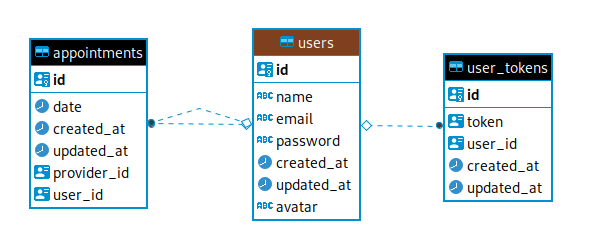

<h1 align="center" >
	
</h1>


<h3 align="center">
  GoBarber API
</h3>

<p align="center">Awsome Aircuts and Shaves</p>

<p align="center">
  

  <a href="https://www.linkedin.com/in/sonnymarinho/">
  
    
  </a>

  

  <a href="https://github.com/sonnymarinho/gobarber-api/commits/master">
    
  </a>

  <a href="https://github.com/sonnymarinho/gobarber-api/issues">
    
  </a>

  
</p>

<p align="center">
  <a href="#-about-the-project">About the project</a>&nbsp;&nbsp;&nbsp;|&nbsp;&nbsp;&nbsp;
  <a href="#-technologies">Technologies</a>&nbsp;&nbsp;&nbsp;|&nbsp;&nbsp;&nbsp;
  <a href="#-getting-started">Getting started</a>&nbsp;&nbsp;&nbsp;|&nbsp;&nbsp;&nbsp;
  <a href="#-how-to-contribute">How to contribute</a>&nbsp;&nbsp;&nbsp;|&nbsp;&nbsp;&nbsp;
  <a href="#-license">License</a>
</p>

<p id="insomniaButton" align="center">
  <a href="docs/insomnia.json" target="_blank"></a>
</p>

## 💻 About
<p>This project is a Rest API for a barbershop application. Its function consists of managing users and appointments: creating user and service providers registers; book appointments between them; send an email for password recovering; caching storage for lists existing providers and appointments; store notifications for new user appointments. </p>

<p> And it was created during the GoStack Bootcamp by Rocketseat. That was focused on creating an entire application using React, React Native, NodeJS, and other tools. Aborting the following topics: ensure authentication, application routes, ORM for database persistence, SQL and NoSQL, caching,  data validation, SOLID, upload files, establishing default linting code pattern, automatic tests, and rater limit. </p>

Check out the **web application**: [gobarber-web](https://github.com/sonnymarinho/gobarber-web)</br>
Check out the **mobile application**: [gobarber-app](https://github.com/sonnymarinho/gobarber-app)

## 🚀 Technologies

Technologies used to develop the API:

- [Node.js](https://nodejs.org/en/)
- [TypeScript](https://www.typescriptlang.org/)
- [Express](https://expressjs.com/pt-br/)
- [Multer](https://github.com/expressjs/multer)
- [TypeORM](https://typeorm.io/#/)
- [JWT-token](https://jwt.io/)
- [uuid v4](https://github.com/thenativeweb/uuidv4/)
- [PostgreSQL](https://www.postgresql.org/)
- [Date-fns](https://date-fns.org/)
- [Jest](https://jestjs.io/)
- [Eslint](https://eslint.org/)
- [Prettier](https://prettier.io/)
- [EditorConfig](https://editorconfig.org/)

## 🔶 Diagram



## ✨️ Getting started

Import the `Insomnia.json` on Insomnia App or click on [Run in Insomnia](#insomniaButton) button

### Requirements

- [Node.js](https://nodejs.org/en/)
- [Yarn](https://classic.yarnpkg.com/) or [npm](https://www.npmjs.com/)
- One instance of [PostgreSQL](https://www.postgresql.org/)
- One instance of [Mongo](https://www.mongodb.com/)
- One instance of [Redis](https://redis.io/)

> Obs.: I recommend use [docker](/docs/using_docker.md)

**1. Clone the project and access the folder**

```bash
$ git clone https://github.com/sonnymarinho/gobarber-api.git && cd gobarber-api
```

**2. Install the dependencies**

```bash
$ yarn
```

**3. Create the docker's containers**

```bash
# Using docker, create the instance of:
# --- PostgreSQL
$ docker run --name gobarber_postgres -e POSTGRES_PASSWORD='mypassword' -p 5432:5432 -d postgres

# --- MongoDB
$ docker run --name gobarber_mongo -p 27017:27017 -d mongo

# --- Redis
$ docker run --name gobarber_redis -p 6379:6379 -d redis:alpine
```

**4. Configure the PostgreSQL**

```bash
# Make sure the keys in 'ormconfig.json' to connect with your database
# are set up correctly, and the container is running.

# Once the services are running, run the migrations
$ yarn typeorm migration:run
```

**5. Create the `.env` file**

```bash
# For the correct functioning of the server, create the .env file at the root of the project.
# (use the .env.example as a base)
```

**6. Start the server**

```bash
# To finish, run the api service
$ yarn dev:server

# Well done, project is started!
```


## 🤔 How to contribute

**Make a fork of this repository**

```bash
# Fork using GitHub official command line
# If you don't have the GitHub CLI, use the web site to do that.

$ gh repo fork sonnymarinho/gobarber-api
```

**Follow the steps below**

```bash
# Clone your fork
$ git clone https://github.com/sonnymarinho/gobarber-api && cd gobarber-api

# Create a branch with your feature
$ git checkout -b my-feature

# Make the commit with your changes
$ git commit -m 'feat: My new feature'

# Send the code to your remote branch
$ git push origin my-feature
```

After your pull request is merged, you can delete your branch

## 📝 License

This project is licensed under the MIT License - see the [LICENSE](https://github.com/git/git-scm.com/blob/master/MIT-LICENSE.txt) file for details.

---

Made with 💜 &nbsp;by Sonny Marinho 👋 &nbsp;[See my linkedin](https://www.linkedin.com/in/sonnymarinho/)
